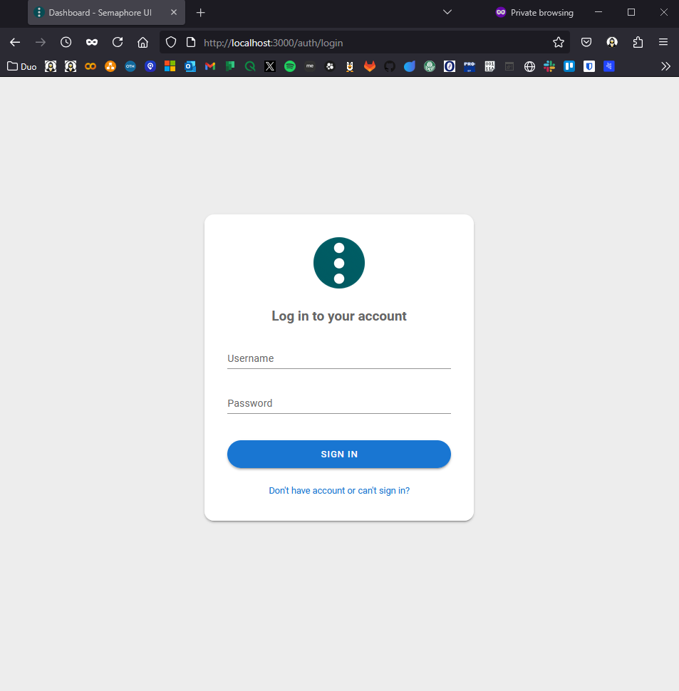
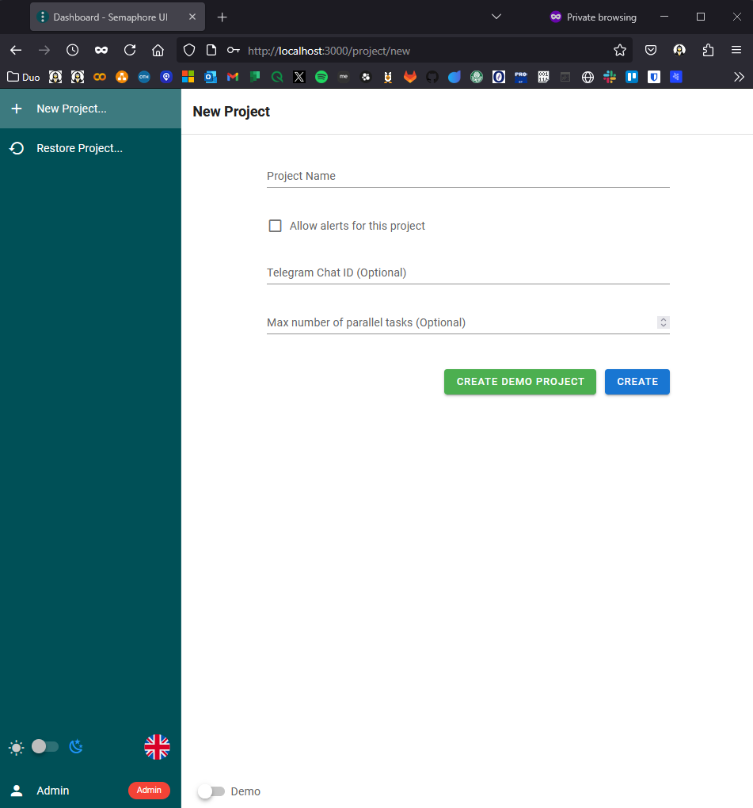
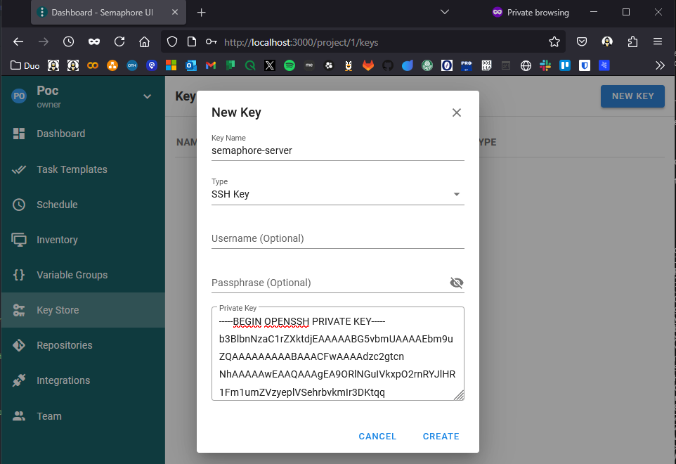
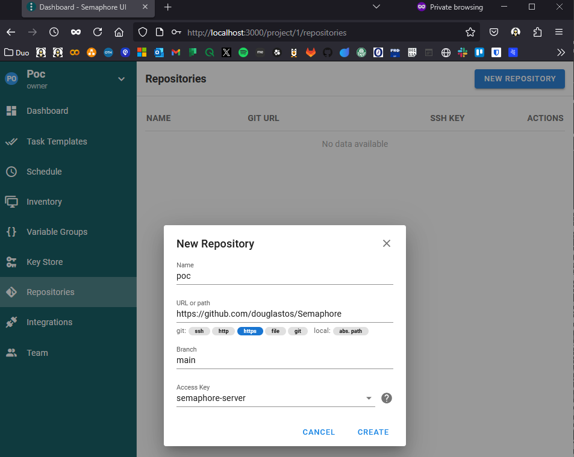
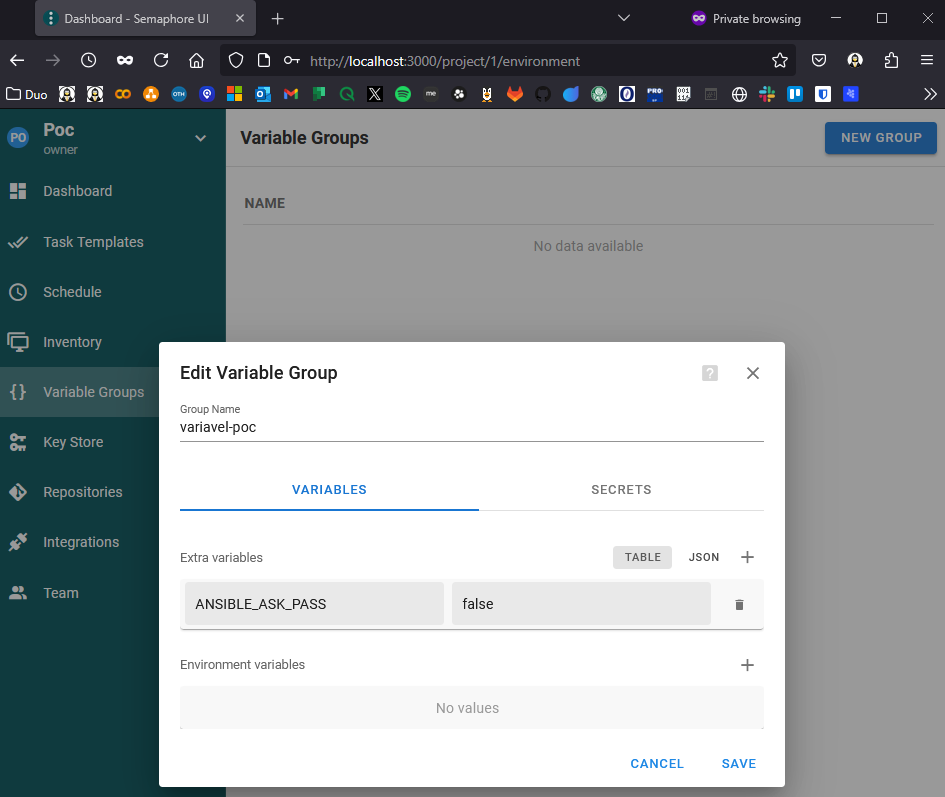
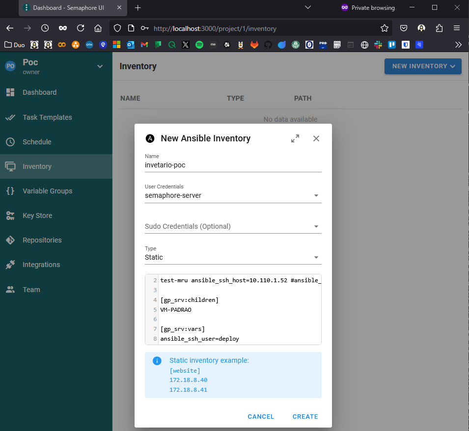
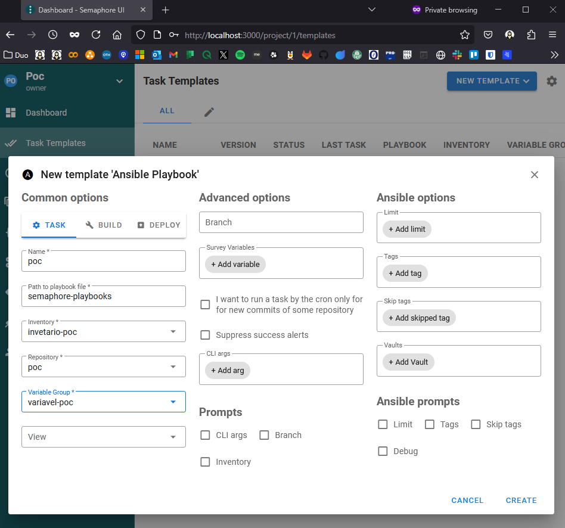
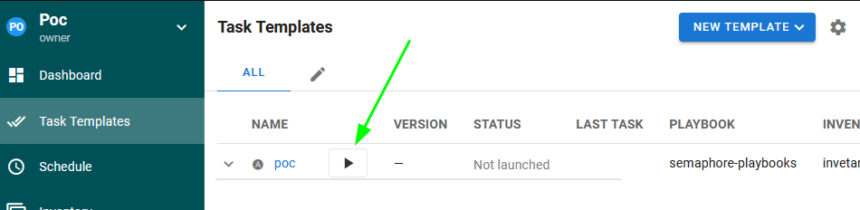
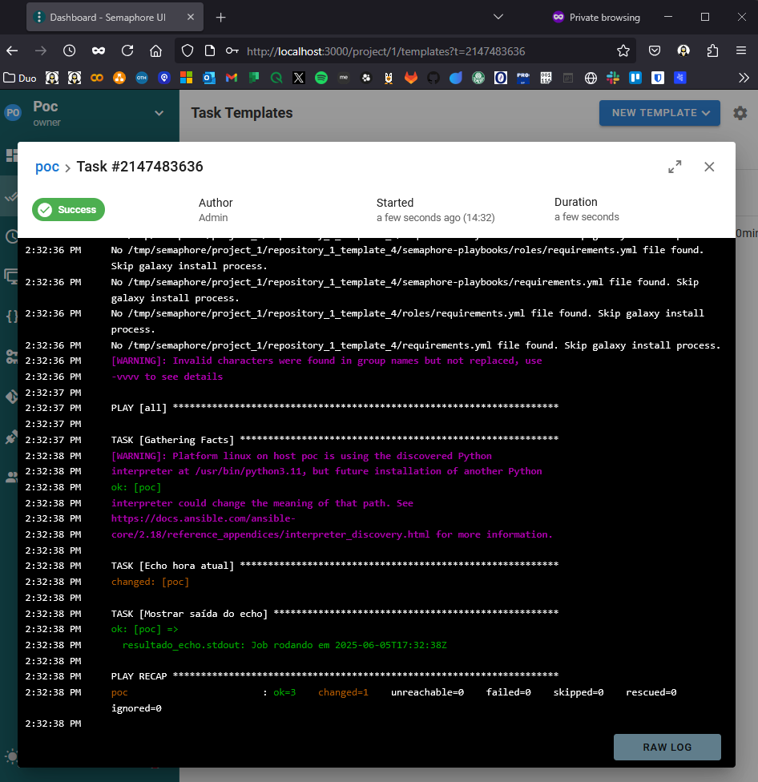

<!-- markdownlint-disable MD033 -->
<!-- markdownlint-disable MD045 -->
<!-- markdownlint-disable MD041 -->
<!-- 
<p align="center">
  
</p> -->


# Simple Proof of Concept Using Semaphore and Ansible

This is a simple project designed as a Proof of Concept (PoC) for using [Semaphore](https://github.com/ansible-semaphore/semaphore) with Ansible.

---

## Prerequisites

Before getting started, make sure you have:

- Docker installed  
- Docker Compose installed  
- Git installed  
- Access to this repository

---

## Getting Started

Clone the project and create a directory where `Semaphore` will store its data:

```bash
git clone https://github.com/douglastos/Semaphore.git
cd Semaphore
mkdir semaphore_data
```

Start the project using:

```bash
docker compose up -d
```

> ⚠️ Note: If you're using an older version, use `docker-compose up -d`.

You should see an output similar to:

```bash
[+] Running 11/11
 ✔ semaphore Pulled                                                                                                                                                         21.5s
...
 ✔ Container semaphore        Started
```

Access Semaphore at: [http://localhost:3000](http://localhost:3000)

You should see the login screen:



---

## Default Credentials

Login using the default user:

- **Username:** `admin`  
- **Password:** `admin`

---

## Creating a Project

On the next screen, create a new project — you can separate them by client or environment if needed.



---

## SSH Key Setup (Inside the Container)

We'll now generate an SSH key to allow Semaphore to connect to the target server.

Access the container shell:

```bash
docker container exec -it semaphore bash
```

Then run the following commands inside the container:

```bash
ssh-keygen -t rsa -b 4096 -C "semaphore@yourproject" -f ~/.ssh/semaphore
ssh-copy-id -i ~/.ssh/semaphore.pub deploy@<your_server_ip>
```

Sample output:

```bash
...
Number of key(s) added: 1

Now try logging into the machine with: 
"ssh -i /home/semaphore/.ssh/semaphore deploy@10.110.1.52"
```

---

## Web Interface Configuration

Now back in the Semaphore web UI, configure the following items **in order**:

1. **Key Store**  
2. **Repositories**  
3. **Variable Groups**  
4. **Inventory**  
5. **Task Templates**

---

### 1. Key Store

Copy the private key from the container:

```bash
cat /home/semaphore/.ssh/semaphore
```

Paste the contents into the "Key Store" section:



---

### 2. Repositories

Add your Git repository:



---

### 3. Variable Groups

Create environment variables as needed:



---

### 4. Inventory

Set up the target servers or environments:



---

### 5. Task Templates

Create a playbook task template:



Then, run it:

  


---

## ✅ Done

You now have a running Semaphore + Ansible environment ready for automation and testing.

---

## Author

[Douglas Ribeiro](https://github.com/douglastos)
